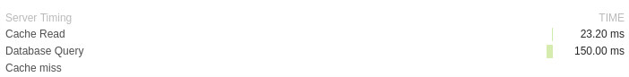

# servertiming

> Go library for adding [`Server-Timing` headers](https://developer.mozilla.org/en-US/docs/Web/HTTP/Headers/Server-Timing) to your application.

[](https://travis-ci.org/rubenv/servertiming) [](https://godoc.org/github.com/rubenv/servertiming)



## Usage

```go
// Create a new instance:

    t := servertiming.New()

// Optionally enable name prefixing to preserve the order of metrics (will adjust names though!)

    t.EnablePrefix()

// Add a few metrics, either by manually specifying the duration:

    t.Add("cache", "Cache Read", 23200*time.Microsecond)

// Or by using the start-stop API:

    ti.Start("db", "Database query")
    // query db
    ti.Stop("db")

// Then send it with your response:

    w.Header().Set("Server-Timing", ti.String())
```

Note: timings can be sent as a trailer when using HTTP2, see the example in `net/http`: [Example (Trailers)](https://godoc.org/net/http#example-ResponseWriter--Trailers).

## License

This library is distributed under the [MIT](LICENSE) license.
